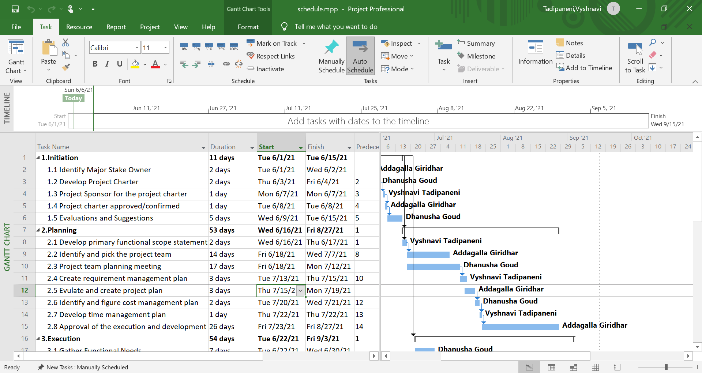
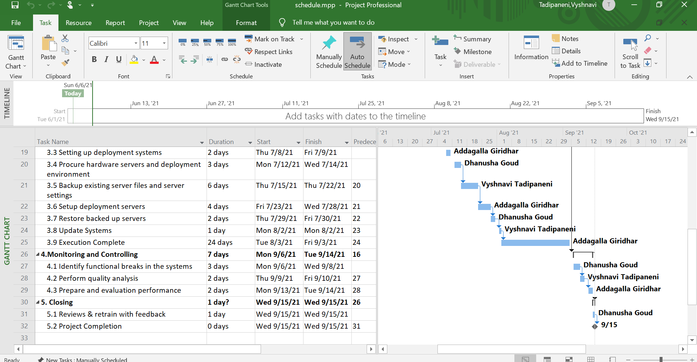
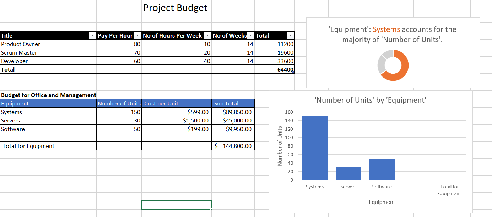

# Ecommerce Website

## Table of Content
* Our Project
* Our Team
* Project Charter
* Scope
* Schedule
* Budget

### Our Project
   <strong>Project Title:</strong> Ecommerece Website 
   <strong>Project Tagline: </strong>Buy from me any where 
   <strong>Team Name: </strong>Easy and Effortable 
   
**Summary:** 
* We are online portals that facilitate online transactions of goods and services through means of the transfer of information and funds over the Internet. 
* The order manager queries your database to find out if the sweater of that exact color and size is actually in stock.
* Nobody likes waiting, not so many people can actually wait. So show your customers that you appreciate their time and don’t make them suffer.

### Our Team

[Giridhar Addagalla](https://github.com/giridhar196)              

[Dhanusha Goud](https://github.com/Dhanushagoud)

[Vyshnavi Tadipaneni](https://github.com/vyshnavi1996)   

### Project Charter
* [Click to view our Project Charter](markdown/charter.md)

### Scope
#### Work Breakdown Structure

#### 1. Intiating
 * 1.1 Identify Major Stake Owner
 * 1.2 Develop Project Charter
 * 1.3 Project Sponsor for the project charter 
 * 1.4 Project charter approved/confirmed
 * 1.5 Evaluations and Suggestions
 
#### 2. Planning 
 * 2.1 Develop primary functional scope statement 
 * 2.2 Identify and pick the project team 
 * 2.3 Project team planning meeting
 * 2.4 Create requirement management plan
 * 2.5 Evulate and create project plan  
 * 2.6 Identify and figure cost management plan 
 * 2.7 Develop time management plan  
 * 2.8 Approval of the execution and development
 
#### 3. Execution
  * 3.1 Gather Functional Needs
  * 3.2 Procure web software
  * 3.3 Setting up deployment systems
  * 3.4 Procure hardware servers and deployment environment
  * 3.5 Backup existing server files and server settings
  * 3.6 Setup deployment servers
  * 3.7 Restore backed up servers
  * 3.8 Update Systems
  * 3.9 Execution Complete
#### 4. Monitoring and Controlling
  * 4.1 Identify functional breaks in the systems
  * 4.2 Perform quality analysis
  * 4.3 Prepare and evaluation performance
  
#### 5. Closing
  * 5.1 Reviews & retrain with feedback
  * 5.2 Project Completion

### Schedule
* Start Date
  * 06/01/2021
* End Date
  * 11/09/2021
* Duration
  * 4 months

### Budget

* Total project Estimated is $75,600
* Total Project Cost is $34,400
* Estimated Profits is $41,200
* [Click to view our Budget Sheet](budget/budget.xlxs)

